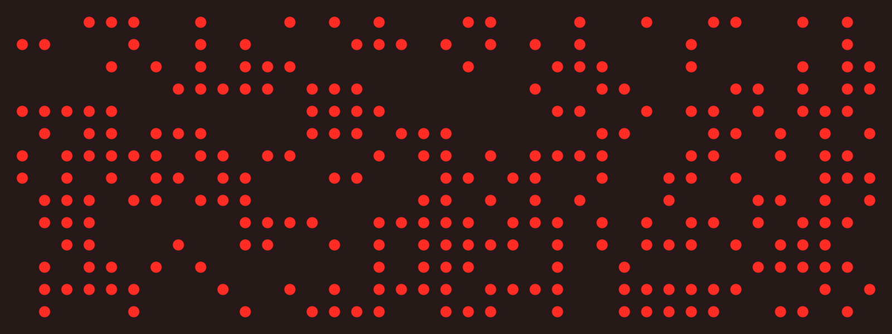
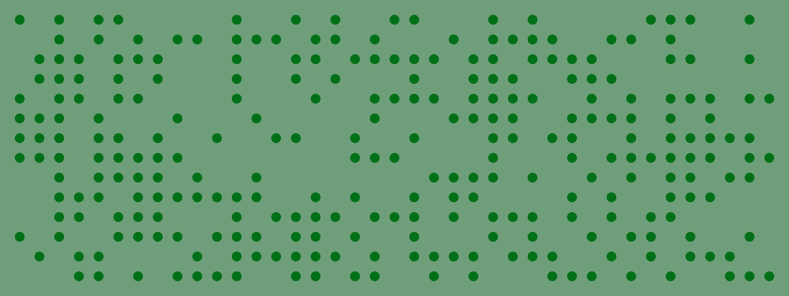
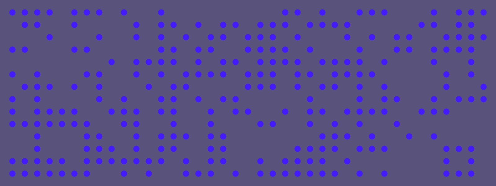
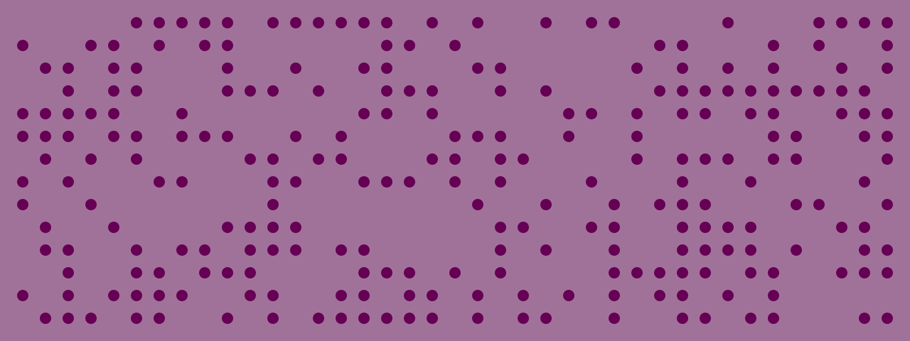

#P5 Punch Card Pattern

The script generates punch card style images with random colors and dot-patterns.

To run the script and generate a pattern, just open the index.html in a browser.
Reloading the page will generate a new pattern. As usual, you can use the f5 key to reload.

If you want to save an image (usually to your Downloads directory / folder) press "s" on your keyboard and confirm that you want to save the image. If you click cancel in the dialog, the file won't be saved but you can still reconsider and press "s" later.

The following images are generated by the script in sketch.js.

If you want to modify it, go ahead, clone or fork the repo and change the logic in sketch.js to your liking.